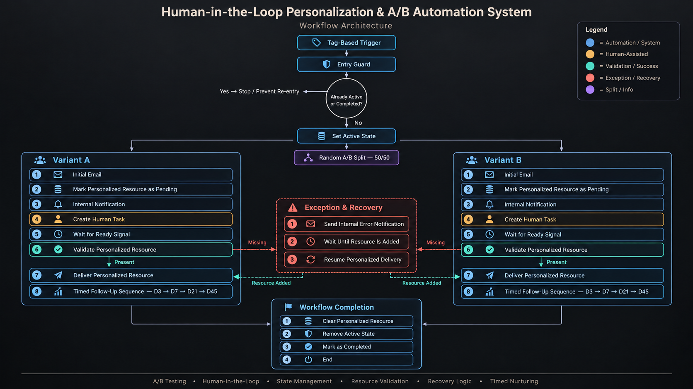

# Human-in-the-Loop Personalization & A/B Automation System

## Overview

A multi-path automation system designed to combine scalable nurturing with controlled human-assisted personalization.

The system uses a 50/50 A/B split, workflow state controls, human task coordination, conditional gates, resource validation, recovery logic, and timed follow-up sequences to ensure that personalized content is created and verified before automated nurturing continues.

## Business Problem

Personalized customer journeys often require human input that cannot be fully automated.

When human work is introduced into an automated workflow, the system must prevent duplicate processing, pause at the correct stage, verify that required information has actually been provided, and recover safely when a required resource is missing.

This architecture coordinates those human and automated steps while maintaining controlled workflow progression.

## System Architecture



### Core Components

- Tag-based workflow entry
- Duplicate and re-entry prevention
- Workflow state management
- Random 50/50 A/B branching
- Human-assisted resource creation
- Internal notifications and task creation
- Conditional readiness gates
- Required-resource validation
- Exception and recovery handling
- Timed multi-step nurturing
- Controlled workflow completion

## High-Level Flow

```text
Tag-Based Trigger
↓
Entry Guard
↓
Already Active or Completed?
├── Yes → Stop / Prevent Re-entry
└── No
    ↓
Set Active State
    ↓
Random A/B Split — 50/50
    │
    ├── Variant A
    │   ↓
    │   Initial Email
    │   ↓
    │   Mark Personalized Resource as Pending
    │   ↓
    │   Internal Notification
    │   ↓
    │   Create Human Task
    │   ↓
    │   Wait for Human Ready Signal
    │   ↓
    │   Validate Resource Presence
    │   ├── Present
    │   │   ↓
    │   │   Deliver Personalized Resource
    │   │
    │   └── Missing
    │       ↓
    │       Send Internal Error Notification
    │       ↓
    │       Wait Until Resource Is Added
    │       ↓
    │       Resume Personalized Delivery
    │
    │   ↓
    │   Timed Follow-Up Sequence
    │   D3 → D7 → D21 → D45
    │
    └── Variant B
        ↓
        Initial Email
        ↓
        Mark Personalized Resource as Pending
        ↓
        Internal Notification
        ↓
        Create Human Task
        ↓
        Wait for Human Ready Signal
        ↓
        Validate Resource Presence
        ├── Present
        │   ↓
        │   Deliver Personalized Resource
        │
        └── Missing
            ↓
            Send Internal Error Notification
            ↓
            Wait Until Resource Is Added
            ↓
            Resume Personalized Delivery

        ↓
        Timed Follow-Up Sequence
        D3 → D7 → D21 → D45

↓
Clear Personalized Resource
↓
Remove Active State
↓
Mark as Completed
↓
End Workflow
```

## Design Decisions

### Re-entry Protection

The workflow checks whether a contact is already active or has previously completed the process before allowing progression.

This prevents duplicate execution and protects the integrity of the customer journey.

### Human-in-the-Loop Personalization

Human intervention is built directly into both A/B variants.

After the initial automated communication, the system creates an internal notification and task for a team member to produce the personalized resource, register it in the system, and signal that it is ready.

### Two-Step Readiness Control

The workflow does not rely solely on the human readiness signal.

After that signal releases the first conditional gate, a second validation verifies that the required personalized resource is actually present before delivery.

This creates an additional safety layer between human action and automated communication.

### Recovery Logic

If the workflow reaches the validation stage but the required resource is missing, it does not continue with incomplete information.

Instead, the system:

1. Sends an internal error notification.
2. Waits until the personalized resource is available.
3. Returns to the personalized delivery step.
4. Continues the normal nurturing sequence.

### A/B Architecture

Contacts are randomly distributed between two 50/50 variants.

Both variants follow the same core system architecture while allowing different communication content and personalized delivery experiences to be evaluated within a controlled structure.

### Timed Nurturing

After personalized delivery, each variant continues through a structured follow-up sequence:

- Day 3
- Day 7
- Day 21
- Day 45

The sequence uses controlled waiting periods between communications before the workflow is closed.

### Controlled Completion

At completion, the system clears the personalized resource, removes the active-state guard, marks the contact as completed, and ends the workflow.

This leaves the contact in a defined final state and prevents unintended workflow re-entry.

## Privacy & Anonymization

This portfolio case study has been intentionally abstracted.

Client names, proprietary tag names, contact information, internal identifiers, credentials, private URLs, email content, templates, custom-field names, assigned-user information, and implementation-specific business data have been removed or generalized.

The case study demonstrates the system architecture, control logic, and design methodology without exposing confidential client information or proprietary implementation details.