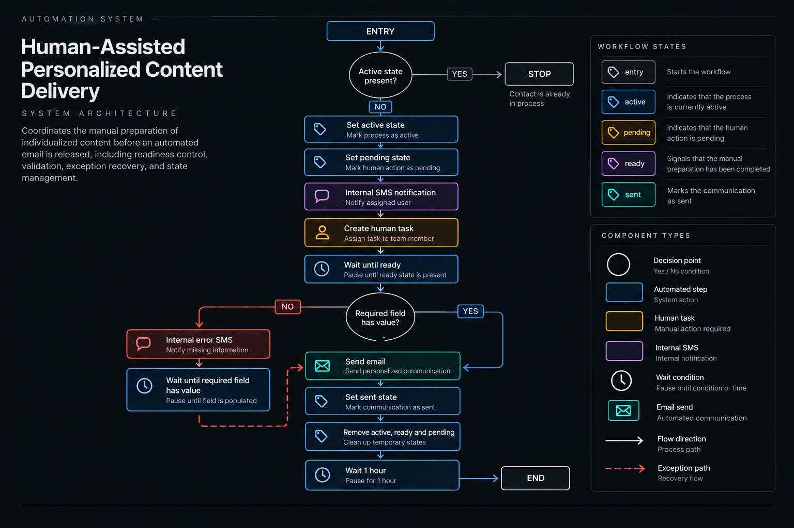

# Human-Assisted Personalized Content Delivery

## Overview

A human-assisted automation designed to coordinate the manual preparation of individualized content before an automated email is released.

The workflow combines process-state controls, internal SMS notifications, human task coordination, a readiness signal, required-field validation, exception recovery, and controlled state cleanup.

It is designed for situations where an automated communication depends on a human action that must be completed and validated before the workflow can proceed.

## Business Problem

Some personalized communications cannot be fully automated because a required resource or piece of information must first be prepared by a team member.

Without additional workflow controls, the automation could progress before the manual work is complete or reach the delivery stage without the required information being available.

The system addresses this dependency by coordinating the human task with automated state tracking, readiness control, data validation, and a recovery path for missing information.

## System Architecture



### Core Components

- Tag-based workflow entry
- Active-state processing control
- Pending-state tracking
- Internal SMS notification
- Human task creation
- Conditional readiness wait
- Required-field validation
- Exception SMS notification
- Recovery wait
- Automated email send
- Sent-state tracking
- Temporary-state cleanup
- Final one-hour wait

## High-Level Flow

```text
Entry
↓
Check Active
├── Yes
│   ↓
│   Stop
│
└── No
    ↓
    Set Active
    ↓
    Set Pending
    ↓
    Internal SMS Notification
    ↓
    Create Human Task
    ↓
    Wait Until Ready
    ↓
    Check Required Field
    ├── Has Value
    │   ↓
    │   Send Email
    │
    └── Missing
        ↓
        Internal Error SMS
        ↓
        Wait Until Required Field Has Value
        ↓
        Return to Send Email

↓
Set Sent
↓
Remove Active / Ready / Pending
↓
Wait 1 Hour
↓
End
```

## Design Decisions

### Active-State Processing Control

At the beginning of the workflow, the system checks whether the `active` state is already present.

If `active` is present, processing stops.

If it is not present, the workflow sets the active state and continues.

This prevents the workflow from starting another processing path while the contact is already marked as active.

### Human Task Coordination

Once processing begins, the workflow sets the `pending` state, sends an internal SMS notification, and creates a task for the assigned user.

The human operator is responsible for preparing the individualized content, storing its required reference in the CRM, and marking the contact as `ready`.

### Readiness Gate

After the task is created, the workflow waits until the `ready` state is present.

This creates an explicit handoff between the manual preparation step and the automated portion of the workflow.

### Two-Step Release Control

The `ready` signal does not release the email directly.

After the readiness condition has been satisfied, the workflow performs a separate validation to confirm that the required custom field contains a value.

This creates two distinct controls before the email step:

1. The human operator signals that the preparation is ready.
2. The system verifies that the required reference is actually present.

### Exception Recovery

If the required custom field is empty after the readiness gate, the workflow does not proceed to the email step.

Instead, it:

1. Sends an internal error SMS.
2. Waits until the required custom field contains a value.
3. Returns to the email send step.
4. Continues through the standard post-send sequence.

The workflow therefore pauses at the exception rather than restarting the complete process.

### Controlled Email Release

The email send step is reached only after the required custom field has been confirmed to contain a value.

This prevents the workflow from releasing the automated communication while the required reference is missing.

### State Cleanup

After the email send step, the workflow adds the `sent` state and removes the temporary `active`, `ready`, and `pending` states.

The workflow then waits for one hour before reaching its visible end.

## Human Component

The assigned user performs the manual portion of the workflow.

### Human Action

The assigned user must:

- Prepare the individualized content
- Store the required reference in the designated CRM field
- Mark the contact as `ready`

### Human Output

The manual step produces two required outputs:

- A populated required custom field
- The `ready` state

Together, these allow the workflow to move through its readiness and validation controls before reaching the automated email step.

## Workflow State Model

| State | Function |
|---|---|
| `entry` | Starts the workflow |
| `active` | Indicates that the process is currently active |
| `pending` | Indicates that the human action is pending |
| `ready` | Signals that the manual preparation has been completed |
| `sent` | Marks the communication as sent |

## Conditional Logic

The workflow uses two decision points and three waits.

### Decision 1 — Active State

```text
active present?
├── Yes → Stop
└── No  → Set Active and Continue
```

### Wait 1 — Human Readiness

```text
Wait until ready
```

The workflow remains paused until the human operator marks the contact as ready.

### Decision 2 — Required Field Validation

```text
required custom field has value?
├── Yes → Send Email
└── No  → Exception Recovery
```

### Wait 2 — Exception Recovery

If the required field is missing:

```text
Internal Error SMS
↓
Wait Until Required Field Has Value
↓
Return to Send Email
```

### Wait 3 — Post-Send

After the email step and state cleanup:

```text
Wait 1 Hour
↓
End
```

## Privacy & Anonymization

This portfolio case study has been intentionally abstracted.

Client names, proprietary tag names, contact information, email content, templates, custom-field names, assigned-user information, credentials, private URLs, internal identifiers, and implementation-specific business data have been removed or generalized.

The case study demonstrates the workflow architecture, human coordination model, validation logic, exception recovery, and state-management approach without exposing confidential client information or proprietary implementation details.