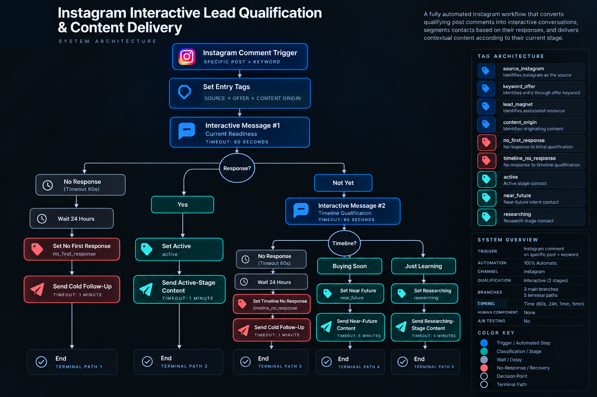

# Instagram Interactive Lead Qualification & Content Delivery

## Overview

A fully automated Instagram workflow designed to convert qualifying post comments into interactive conversations, segment contacts according to their responses, and deliver contextual content based on their current stage.

The workflow combines comment-based entry, source attribution, interactive qualification, nested branching, behavioral segmentation, timeout recovery, and stage-based content delivery.

No human intervention is required during the workflow.

## Business Problem

A social media comment can indicate interest, but it does not provide enough information to determine a contact's current level of readiness or what content should be delivered next.

Treating every contact the same would remove important context from the interaction.

The workflow addresses this by progressively qualifying the contact through interactive Instagram messages and routing each response into a stage-specific content path.

Contacts who do not respond are handled through dedicated timeout recovery paths rather than being immediately discarded.

## System Architecture



### Core Components

- Instagram comment trigger
- Keyword-based entry
- Source, offer, lead-magnet, and content-origin tagging
- Interactive qualification
- Nested conditional branching
- Response-based stage classification
- Timeout detection
- 24-hour recovery waits
- Non-response state tracking
- Contextual content delivery
- Automated cold follow-up
- Five terminal paths
- Fully automated execution

## High-Level Flow

```text
Instagram Comment Trigger
↓
Set Source + Offer + Lead Magnet + Content-Origin Tags
↓
Interactive Message #1
Current Readiness
Timeout: 60 sec
│
├── Default Timeout
│   ↓
│   Wait 24 Hours
│   ↓
│   Set No First Response
│   ↓
│   Send Cold Follow-Up
│   ↓
│   Timeout: 1 min
│   ↓
│   End
│
├── Yes
│   ↓
│   Set Active
│   ↓
│   Send Active-Stage Content
│   ↓
│   Timeout: 1 min
│   ↓
│   End
│
└── Not Yet
    ↓
    Interactive Message #2
    Timeline Qualification
    Timeout: 60 sec
    │
    ├── Default Timeout
    │   ↓
    │   Wait 24 Hours
    │   ↓
    │   Set Timeline No Response
    │   ↓
    │   Send Cold Follow-Up
    │   ↓
    │   Timeout: 1 min
    │   ↓
    │   End
    │
    ├── Buying Soon
    │   ↓
    │   Set Near Future
    │   ↓
    │   Send Near-Future Content
    │   ↓
    │   Timeout: 5 min
    │   ↓
    │   End
    │
    └── Just Learning
        ↓
        Set Researching
        ↓
        Send Researching-Stage Content
        ↓
        Timeout: 5 min
        ↓
        End
```

## Design Decisions

### Comment-Based Entry

The workflow begins when a contact comments on a specific Instagram post using the configured keyword.

At entry, the system applies functional tags that preserve the Instagram source, offer context, associated lead magnet, and originating content.

This maintains the context of how the contact entered the workflow.

### Progressive Qualification

The workflow qualifies the contact in stages rather than requiring every contact to complete the same sequence.

The first interactive message evaluates current readiness.

Contacts who answer `Yes` move directly into the active-stage path.

Contacts who answer `Not Yet` continue into a second qualification step focused on timeline.

### Nested Qualification

The second interactive message exists only within the `Not Yet` branch.

It separates those contacts into two additional stages:

- `near_future`
- `researching`

This allows the workflow to distinguish between contacts with closer intent and those who are still in the research stage.

### Behavioral Segmentation

The workflow assigns functional states based on both responses and non-response behavior.

Contacts can be classified as:

- `active`
- `near_future`
- `researching`
- `no_first_response`
- `timeline_no_response`

These states represent either qualification outcomes or timeout behavior within the workflow.

## Timeout Recovery

Both interactive qualification stages include a 60-second response timeout.

If no response is received, the workflow enters a dedicated recovery path.

The corresponding timeout route:

1. Waits 24 hours.
2. Applies the appropriate non-response state.
3. Sends a cold follow-up message.
4. Reaches a one-minute final timeout.
5. Ends.

The first and second qualification stages maintain separate non-response states.

## Contextual Content Delivery

Contacts who respond are routed to content aligned with the stage identified during qualification.

### Active

```text
Yes
↓
Set Active
↓
Send Active-Stage Content
↓
Timeout: 1 min
↓
End
```

### Near Future

```text
Not Yet
↓
Buying Soon
↓
Set Near Future
↓
Send Near-Future Content
↓
Timeout: 5 min
↓
End
```

### Researching

```text
Not Yet
↓
Just Learning
↓
Set Researching
↓
Send Researching-Stage Content
↓
Timeout: 5 min
↓
End
```

The delivery path therefore changes according to information provided during the interactive qualification process.

## Workflow State Model

| State | Function |
|---|---|
| `source_instagram` | Identifies Instagram as the contact source |
| `keyword_offer` | Identifies entry through the configured offer keyword |
| `lead_magnet` | Identifies the resource associated with the entry |
| `content_origin` | Identifies the originating content |
| `no_first_response` | Marks no response to the initial qualification |
| `timeline_no_response` | Marks no response to the timeline qualification |
| `active` | Classifies a contact in the active stage |
| `near_future` | Classifies a contact with near-future intent |
| `researching` | Classifies a contact in the research stage |

## Terminal Paths

The workflow contains five terminal routes:

1. Initial qualification timeout → Cold Follow-Up
2. Yes → Active-Stage Content
3. Timeline qualification timeout → Cold Follow-Up
4. Buying Soon → Near-Future Content
5. Just Learning → Researching-Stage Content

Each route ends after the timeout associated with its final message.

There is no visible rejoin or subsequent action after these terminal paths.

## Automation Model

This workflow is fully automated.

No manual task, approval step, or human intervention is required between entry and completion.

Qualification, segmentation, timeout recovery, and content delivery are controlled entirely by the workflow logic.

## Privacy & Anonymization

This portfolio case study has been intentionally abstracted.

Client names, account identifiers, specific Instagram pages and posts, proprietary keywords, message copy, content URLs, offer names, lead-magnet names, source-specific tag names, credentials, private links, and implementation-specific business data have been removed or generalized.

The case study demonstrates the interaction architecture, qualification logic, segmentation model, timeout recovery, and contextual delivery strategy without exposing confidential client information or proprietary implementation details.