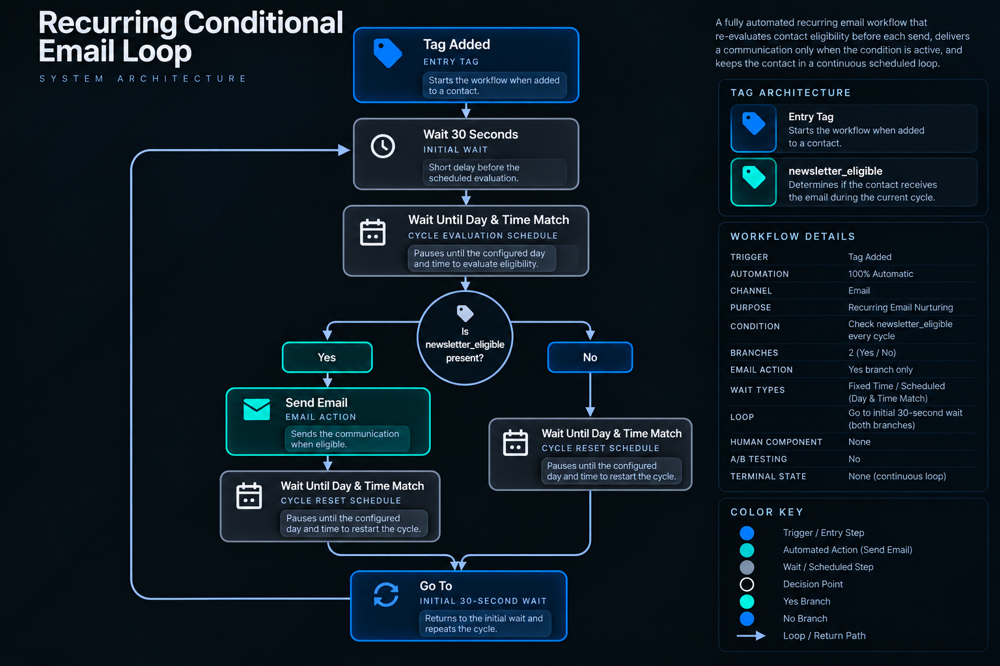

# Recurring Conditional Email Loop

## Overview

A fully automated recurring email workflow designed to keep contacts inside a scheduled cycle while re-evaluating their eligibility before each possible send.

The workflow combines tag-based entry, an initial fixed wait, configured day-and-time schedules, recurring eligibility validation, conditional email delivery, and loop-based execution.

The email is sent only when the eligibility condition is present during the current cycle.

No human intervention is required.

## Business Problem

A contact may enter a recurring communication workflow while eligible, but that eligibility can change between cycles.

If future sends relied only on the contact's original workflow entry, communications could continue even when the qualifying condition was no longer present.

This architecture separates recurrence from eligibility.

Each cycle performs a new eligibility check before reaching the email action.

Eligible contacts receive the communication. Ineligible contacts skip the email and continue through the same recurring cycle.

## System Architecture



### Core Components

- Tag-based workflow entry
- Initial 30-second wait
- Configured cycle evaluation schedule
- Functional eligibility check
- Conditional email delivery
- No-send branch
- Configured cycle reset schedule
- `Go To` loop control
- Recurring eligibility re-evaluation
- Fully automated execution
- No explicit end state

## High-Level Flow

```text
Tag Added
↓
Wait 30 Seconds
↓
Wait Until Day & Time Match
Cycle Evaluation Schedule
↓
Check Newsletter Eligibility
│
├── YES
│   ↓
│   Send Email
│   ↓
│   Wait Until Day & Time Match
│   Cycle Reset Schedule
│   ↓
│   Go To Initial 30-Second Wait
│   ↓
│   Loop
│
└── NO
    ↓
    Wait Until Day & Time Match
    Cycle Reset Schedule
    ↓
    Go To Initial 30-Second Wait
    ↓
    Loop
```

## Design Decisions

### Tag-Based Entry

The workflow begins when the configured entry tag is added to a contact.

This entry tag starts the workflow but does not determine whether the recurring email is sent.

Email eligibility is evaluated separately during each cycle.

### Scheduled Cycle

After entry, the workflow waits 30 seconds and then pauses until the configured day and time match the cycle evaluation schedule.

The eligibility check occurs after this scheduled wait.

After either branch completes its path, the workflow waits until the configured cycle reset schedule is reached and then returns to the initial 30-second wait.

The scheduling sequence then begins again.

### Eligibility Re-Evaluation

The workflow checks the `newsletter_eligible` state during every cycle.

The result of one cycle does not determine the result of the next cycle.

Instead, the eligibility condition is evaluated again before each possible email send.

This allows the send decision to reflect the state present during the current iteration.

### Conditional Delivery

The email action exists only on the `YES` branch.

```text
newsletter_eligible present?
├── YES → Send Email
└── NO  → Skip Email
```

A contact therefore reaches the email action only when the functional eligibility condition is present at the time of evaluation.

### No-Send Path

When `newsletter_eligible` is not present, no email is sent during that cycle.

The contact proceeds directly to the configured cycle reset schedule and then returns to the beginning of the recurring sequence.

The contact therefore remains inside the loop even when a communication is skipped.

### Synchronized Recurrence

Both the `YES` and `NO` branches reach the same configured cycle reset schedule before returning to the initial wait.

The `YES` branch includes the email action before this point.

The `NO` branch does not.

Both branches then use `Go To` to return to the initial 30-second wait.

### Open Loop Architecture

The documented workflow contains no explicit terminal action.

Both branches return to the initial wait and repeat the recurring sequence.

No exit condition, maximum iteration count, or completion state is included in the documented architecture.

## Eligibility Model

The workflow uses one functional eligibility state.

| State | Function |
|---|---|
| `newsletter_eligible` | Determines whether the email is sent during the current cycle |

The state is evaluated again during every iteration.

## Timing Model

The workflow contains three timing stages.

### Initial Wait

```text
Wait 30 Seconds
```

### Cycle Evaluation Schedule

```text
Wait Until Day & Time Match
↓
Check Newsletter Eligibility
```

This scheduled wait determines when the eligibility condition is evaluated.

### Cycle Reset Schedule

Both branches reach:

```text
Wait Until Day & Time Match
↓
Go To Initial 30-Second Wait
```

The workflow then repeats the same scheduling and eligibility sequence.

## Branch Behavior

### Eligible Path

```text
Check Newsletter Eligibility
↓
YES
↓
Send Email
↓
Wait Until Day & Time Match
↓
Go To Initial 30-Second Wait
```

### Not Eligible Path

```text
Check Newsletter Eligibility
↓
NO
↓
No Email Sent
↓
Wait Until Day & Time Match
↓
Go To Initial 30-Second Wait
```

Both paths return to the recurring loop.

## Automation Model

This workflow is fully automated.

There are no manual tasks, approvals, or human-dependent transitions within the documented architecture.

Scheduling, eligibility validation, conditional delivery, and recurrence are controlled by workflow logic.

## Privacy & Anonymization

This portfolio case study has been intentionally abstracted.

Client names, proprietary entry tags, specific scheduling values, email content, templates, sender information, template identifiers, credentials, internal IDs, private links, and implementation-specific business data have been removed or generalized.

The case study demonstrates recurring workflow architecture, eligibility re-evaluation, conditional delivery, scheduled execution, and loop control without exposing confidential client information or proprietary implementation details.